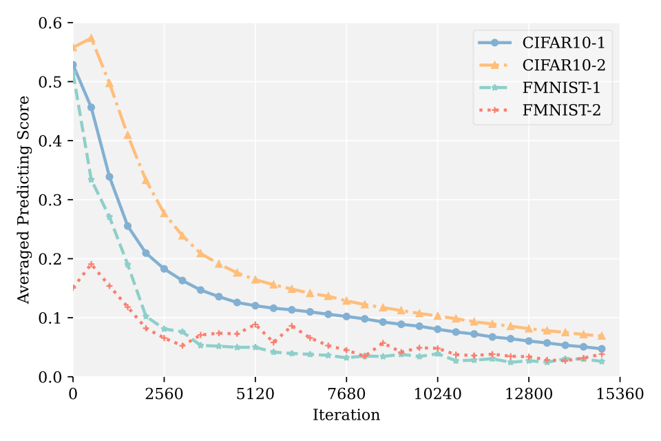
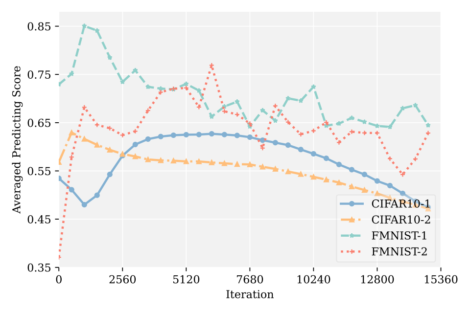
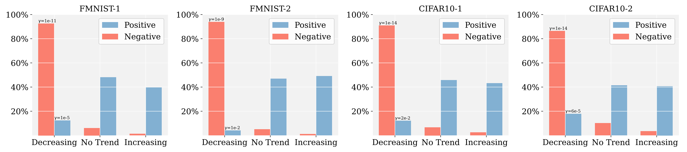

# Beyond Myopia: Learning from Positive and Unlabeled Data through Holistic Predictive Trends [NeurIPS 2023]
## Method
## Negative trend
<p align="center">
  
</p>
## Positive trend
<p align="center">
  
</p>
## Trend Statistics
<p align="center">
  
</p>
## Running
```
sh ./run.sh
```
All best hyperparameters are reported in run.sh
## Reference
@article{wang2023beyond,
  title={Beyond Myopia: Learning from Positive and Unlabeled Data through Holistic Predictive Trends},
  author={Wang, Xinrui and Wan, Wenhai and Geng, Chuanxin and LI, Shaoyuan and Chen, Songcan},
  journal={arXiv preprint arXiv:2310.04078},
  year={2023}
}
